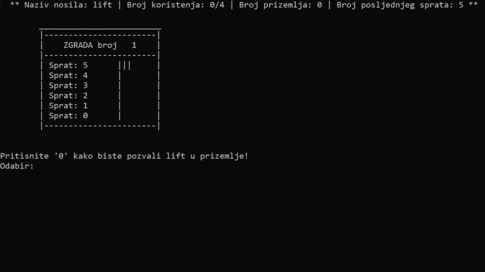

# Elevator System

The Elevator system is my first student project and is open-source software written in C. It manages elevators in a building via two panels: the Admin Panel and the User Panel.

The **Admin Panel** serves as the system control center. Administrators can create and manage users, assign permissions, create and edit elevators, view elevator statuses, reset usage counters and repair flags. Administrators can also unblock elevators that were previously blocked.

Each elevator has a defined number of uses before a repair flag is triggered, indicating maintenance is required. Administrators can reset this flag as needed.

The **User Panel** allows users to activate elevators before use. Activated elevators provide a basic interface (shown in the preview). If an elevator has a repair flag, it becomes unavailable until maintenance is completed.

This system offers an intuitive interface for both administrators and users, enabling efficient elevator usage tracking, condition monitoring and timely maintenance management.

## 👀 Preview

## ⚙️ Installation

To install and use the Elevator system:

1. Download the entire project package from this GitHub repository.  
2. Compile and run the main program (instructions depend on your platform and C compiler).  

The system is built in C and is compatible with major operating systems. There are no complex dependencies or external libraries required.

## ✉️ Contact

 

## 👍 Feedback

Your feedback on the Elevator system project is highly appreciated. As my first student project, I welcome constructive comments and suggestions to improve it. Please leave feedback on the GitHub repository or contact me via LinkedIn. Thank you for your time and support!
